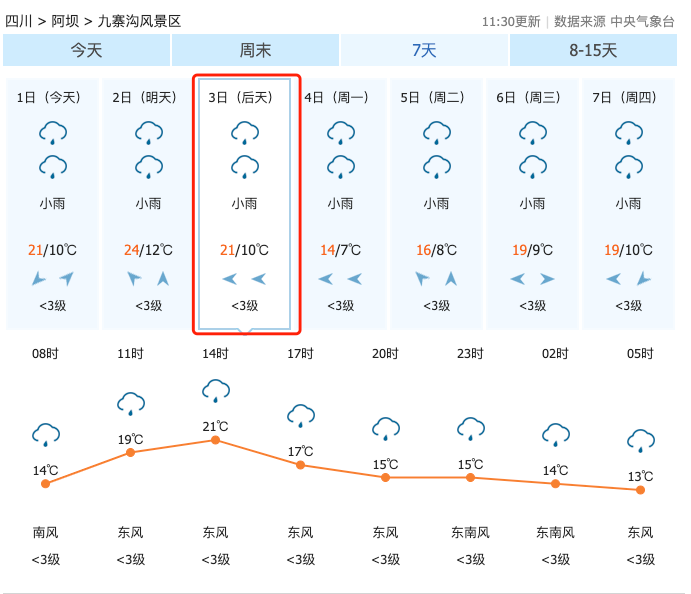
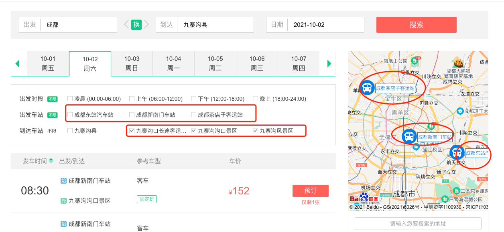
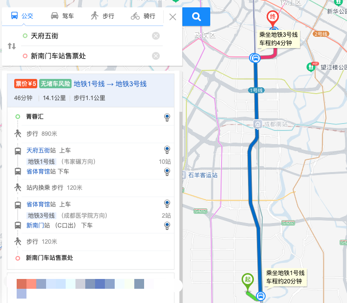
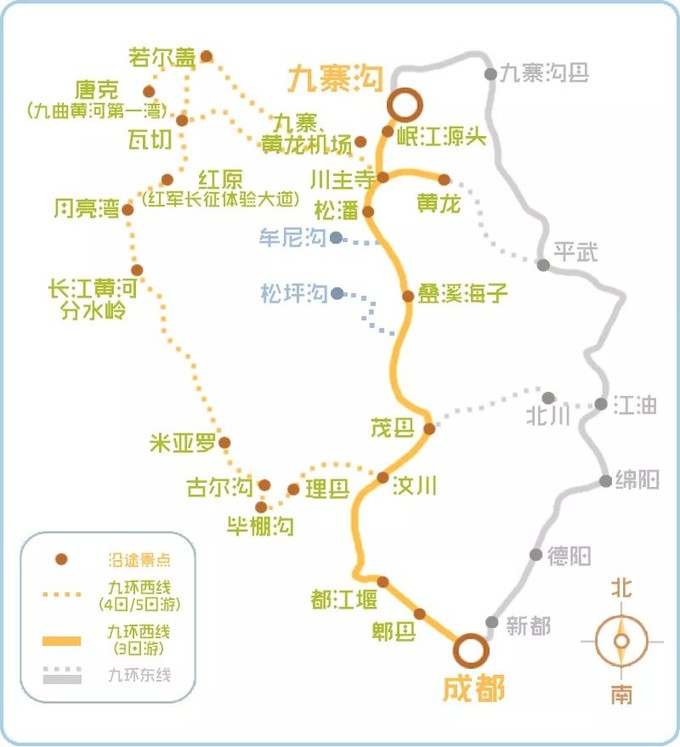
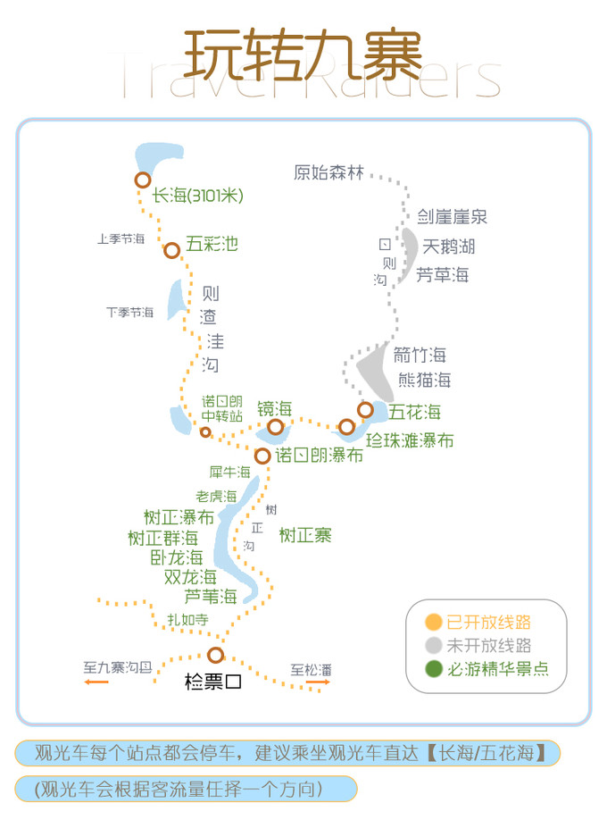

## 九寨沟旅游计划
- 预计出发日期：2021年10月2日
- 景区订票方式：[官网或小程序](http://www.abatour.com/)
- 交通信息：[九寨沟交通](http://www.abatour.com/travel/xianjzg/jzg/jingqu_0005.htmlvvvv)
- 班车订票方式：[同城旅行](https://bus.ly.com/#/list?startname=%E6%88%90%E9%83%BD&arrivename=%E4%B9%9D%E5%AF%A8%E6%B2%9F%E5%8E%BF&startdatetime=2021-10-02&startStation=&arriveStation=&depCId=1328&desCId=3993&refid=1035396140) 或 搜索各大客运站的公众号或网站，如[成都集散中心](https://public.tz12306.com/)
- 注意：国庆等高峰期最好提前两天订票（门票、车票、住宿）

## 九寨沟天气
可能有雨，天气转凉，需要带外套和伞。  

## 出行方案
方案1：飞机（单程￥1700,4h）  
{成都} --飞机￥1600,2h--> {黄龙机场} --大巴￥50,2h--> {九寨沟景区}

方案2：火车（单程￥300,13h）   
{成都} --火车￥150,7h--> {陇南站} --大巴￥80,5h--> {九寨沟县} --打车￥80,1h--> {九寨沟县售票处}

方案3：大巴（单程170,10h）  
{成都新南门汽车站} --大巴￥170,11h--> {九寨沟景区} （30分钟一班,8:00~10:00）

## 计划时间
- 10月2日: 8:00成都-->九寨沟20:00(吃饭，住九寨沟
- 10月3日：九寨沟游玩，晚上住九寨沟
- 10月4日：8:00九寨沟-->成都
- 10月5日：大熊猫基地
- 10月6日：春熙路
- 10月7日：休息

回程：九寨沟到成都的大巴从6点半开始，半小时发一班，最晚到10点

## 需要准备的物品
- 身份证
- 手机、充电宝、充电线。
- 洗漱用品（牙膏、牙刷、洗面奶、防晒霜、毛巾）
- 衣服（外套+伞）
- 食物（自热饭，水、零食，小吃等）

## 成都 --> 九寨沟

7点起床，简单洗漱后出发，做地铁到新南门客运站。

8点30从新南门客运站到九寨沟客运站，大概11小时，晚上7点左右到。

## 预算
- 门票+观光车： 260
- 来回大巴：￥340
- 2天住宿：￥600
- 合计：￥1200/人

## 导览图  
成都到九寨沟自家路线   

九寨沟导览图  

参考文章
- [2019年--2020如何玩转九寨沟](2020如何玩转九寨沟，看这篇攻略就足够了)
- [冬季的九寨沟：路线玩法超强攻略](https://www.mafengwo.cn/gonglve/ziyouxing/311796.html)
- [2019年--九寨沟照片欣赏](https://www.mafengwo.cn/gonglve/ziyouxing/320180.html)
- [2019年--冬天的九寨沟](https://www.mafengwo.cn/gonglve/ziyouxing/317948.html)
- [2017年--九寨沟要这样玩才能不留遗憾](https://www.mafengwo.cn/gonglve/ziyouxing/2855.html)
- [2012年--自助游九寨沟超详尽攻略](http://www.mafengwo.cn/i/935765.html)
- [2011年--十月迷失在五彩的九寨沟](https://www.mafengwo.cn/i/759584.html)
